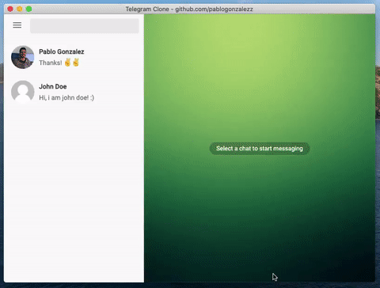

<h1 align="center">Welcome to Telegram Clone 👋</h1>
<p>
  <a href="https://github.com/avneesh0612/audible-clone/blob/main/LICENSE" target="_blank">
    
  </a>
  <a href="https://linkedin.com/in/pablogonzalezzz" target="_blank">
    
  </a>
</p>



This project was generated using Electron + Angular frameworks.


## Development server
```Shell
# Install all dependencies
npm install

# Run development server
npm run start:electron
```

## 🤝 Contribution
If you want to contribute to this project, see the [CONTRIBUTION.md](CONTRIBUTION.md) file.

### Hacktoberfest 2021
Want to join [Hacktoberfest 2021](https://hacktoberfest.digitalocean.com/) and have your PR approved on this repo? It's simple!
* Go to [conversations.json](src/assets/conversations.json) file
* Add a conversation with your name and photo following the format below
```JSON
 {
  "id":2,
  "name": "John Doe",
  "status": "Online",
  "image": "assets/default-user-image.png",
  "messages": [
      {
          "sender": "sender", "time": "14:27", "message": "Hi, i am john doe! :)"
      }
  ]
}
```
* And that's it 😁 Your message should appear in the app messages.

## 📝 License

Copyright © 2021 [Pablo Gonzalez](https://github.com/pablogonzalezz).<br />
This project is [MIT](https://github.com/pablogonzalezz/telegram-clone/blob/main/LICENSE) licensed.
